# 📋 Task Management App

A modern and responsive Task Management application built with **React.js**, **React Router**, **Tailwind CSS**, and **Local Storage**.

The application allows users to register, log in securely, manage daily tasks, set priorities, assign due dates, search, filter, sort, and track task progress through a clean and interactive dashboard.

---

# 📖 Description

The Task Management App is designed to help users efficiently organize and manage their daily work.

Users must first create an account before accessing the dashboard. After logging in, they can create, edit, delete, search, filter, and sort tasks while all data is stored locally using the browser's Local Storage.

This project demonstrates core React concepts including:

- React Components
- React Hooks
- React Router
- State Management
- CRUD Operations
- Local Storage
- Responsive UI Design

---

# ✨ Features

### Authentication

- User Registration
- Secure Login
- Login Validation
- Prevent Login without Registration
- Logout Functionality

### Task Management

- Add Task
- Edit Task
- Delete Task
- Mark Task as Completed
- Undo Completed Tasks

### Task Details

- Task Title
- Description
- Due Date
- Priority Level
- Completion Status

### Search & Filter

- Search Tasks
- Filter by Status
- Filter by Priority

### Sorting

- Recently Added
- Oldest First
- Due Date
- Priority

### Dashboard

- Welcome User
- Statistics Cards
- Responsive Layout
- Beautiful Task Cards

### Storage

- Local Storage Support
- Automatic Data Persistence

### Pages

- Login
- Register
- Dashboard
- About
- 404 Not Found

---

# 🛠 Technologies Used

- React.js
- React Router DOM
- Tailwind CSS
- React Icons
- UUID
- JavaScript (ES6)
- HTML5
- CSS3
- Local Storage

---

# 🚀 Installation Steps

## 1 Clone Repository

```bash
git clone https://github.com/yourusername/task-management-app.git
```

## 2 Go to Project Folder

```bash
cd task-management-app
```

## 3 Install Dependencies

```bash
npm install
```

## 4 Start Development Server

```bash
npm run dev
```

## 5 Open Browser

```
http://localhost:5173
```

---

# 📁 Folder Structure

```
src
│
├── components
│   ├── Footer
│   ├── Navbar
│   ├── Sidebar
│   ├── TaskCard
│   └── TaskForm
│
├── pages
│   ├── Login
│   ├── Register
│   ├── Dashboard
│   ├── About
│   └── NotFound
│
├── App.jsx
├── main.jsx
└── index.css
```

---

# 📷 Screenshots
## 📸 Screenshots

### 🏠 Home Page
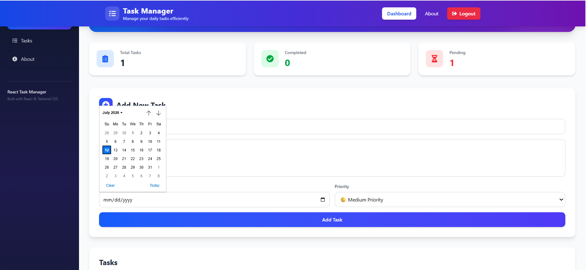

### ➕ Add New Task
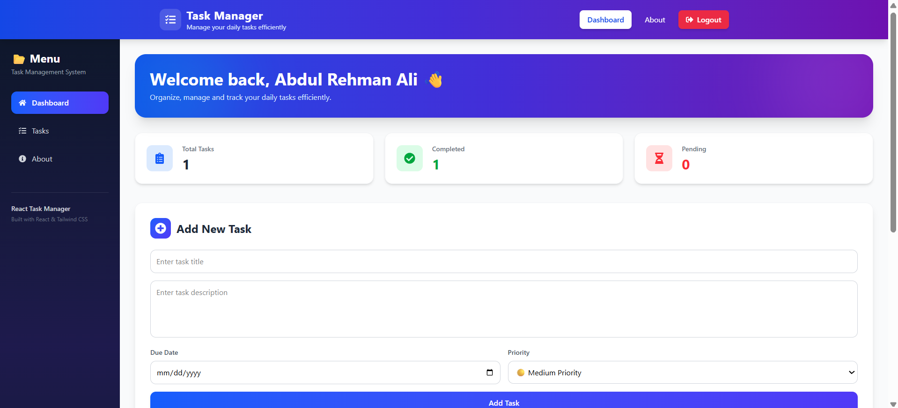

### ✏️ Edit Task
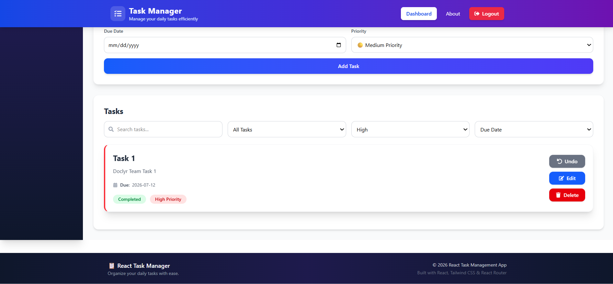

### 🔍 Search & Filter Tasks
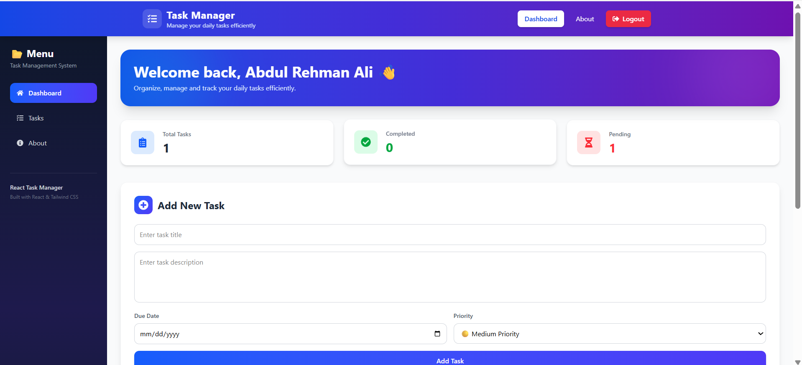

### 📋 Task List
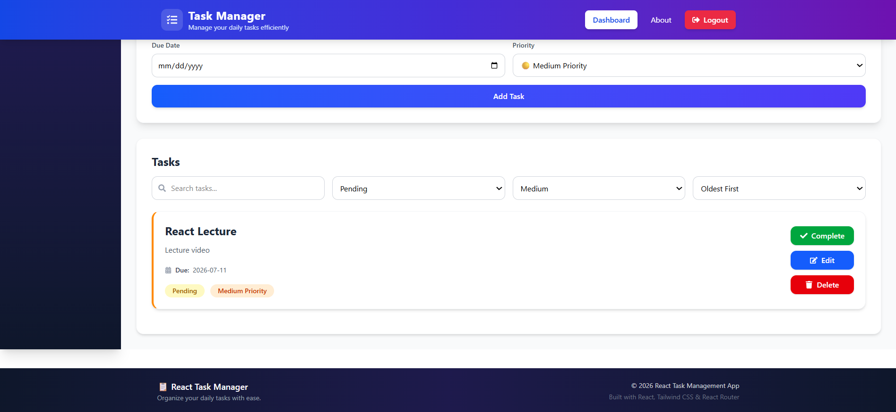

### 📊 Task Statistics
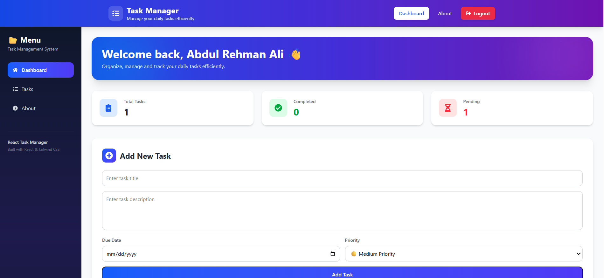

### 📱 Responsive Layout
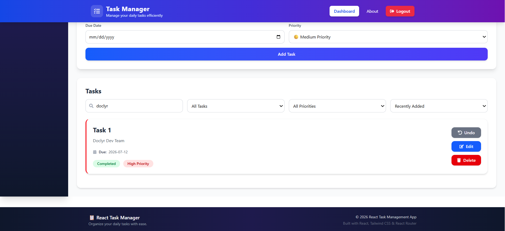

### ℹ️ About Page
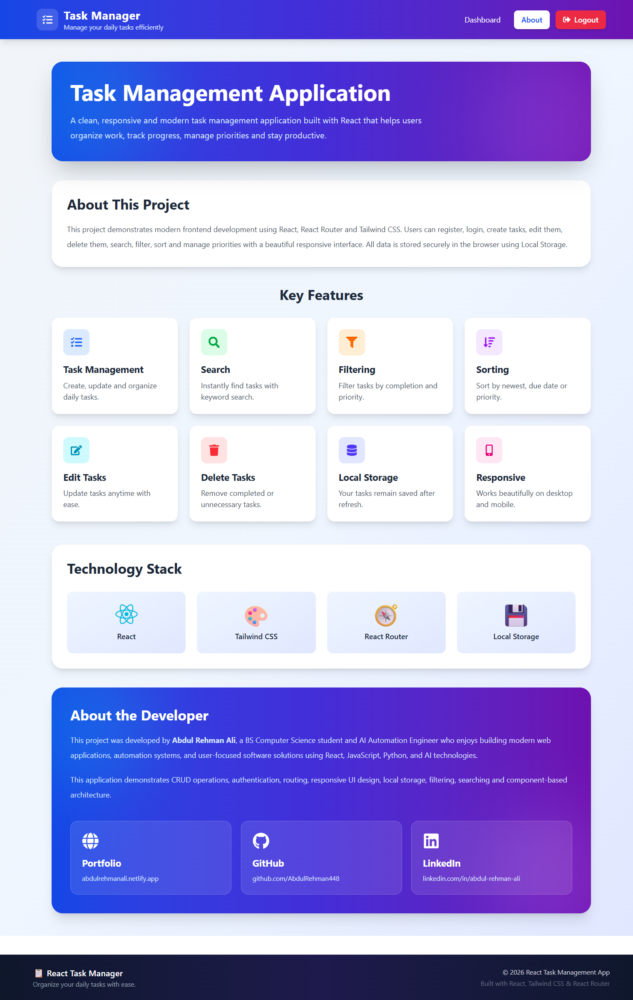

### 📌 Dashboard Overview
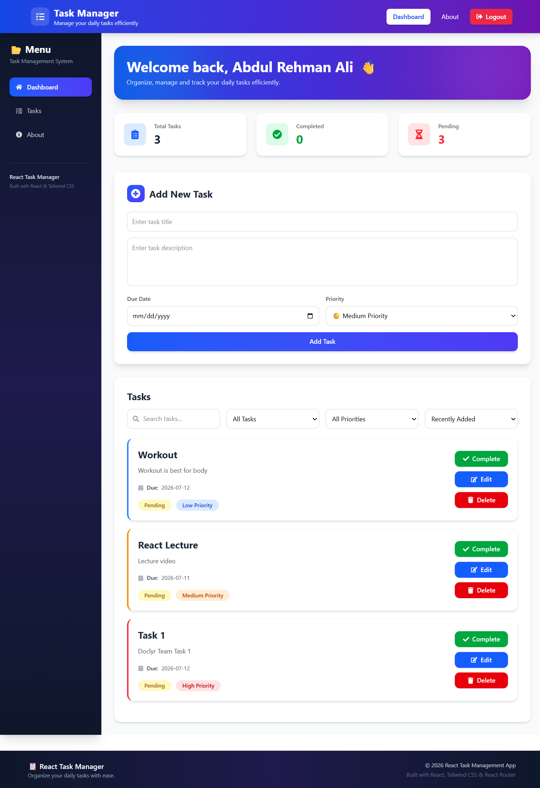

### 📌 Dashboard with Tasks
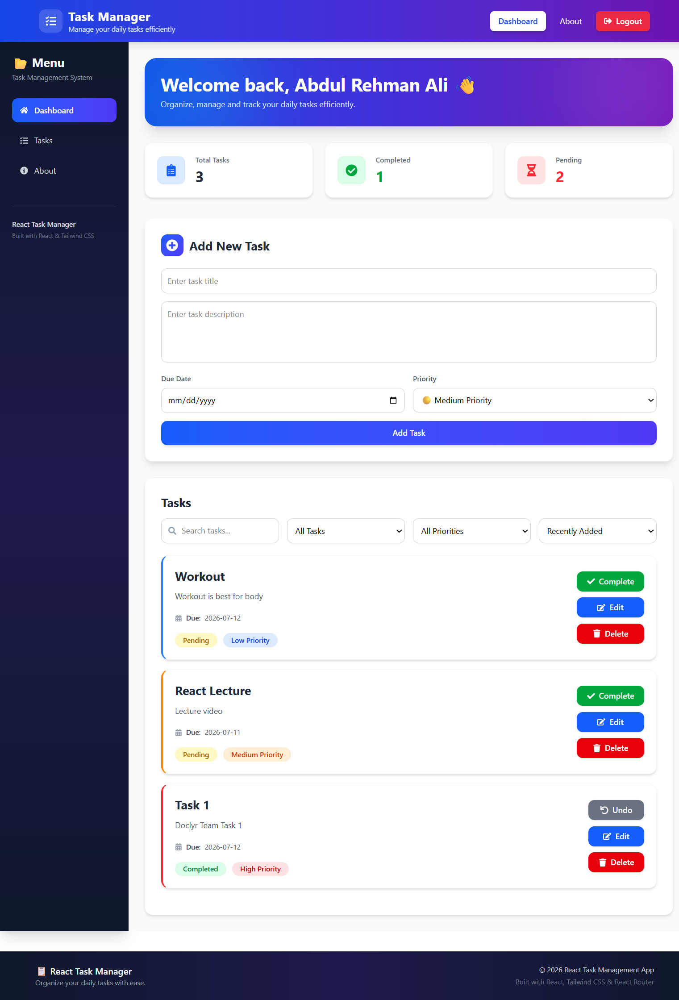

### 🔐 Login Page
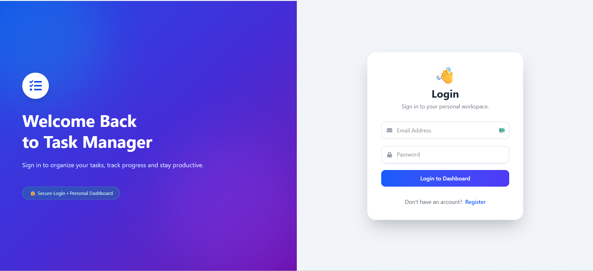

### 📝 Register Page
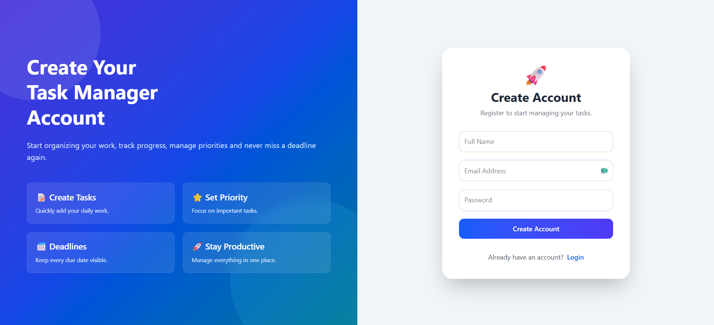

### 🚫 404 Not Found Page
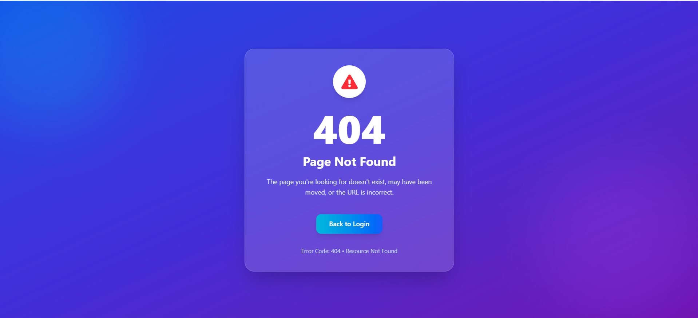
---

# 🌐 Live Demo

If deployed, add your live project link here.

```
https://your-project-link.vercel.app
```

---

# 📚 Learning Outcomes

This project helped in understanding:

- React Components
- React Hooks
- React Router
- CRUD Operations
- State Management
- Local Storage
- Responsive UI Design
- Form Handling
- Search, Filter & Sorting
- Component Reusability
- Clean Project Structure

---

# 📄 License

This project was developed for educational purposes as part of a React.js assignment.